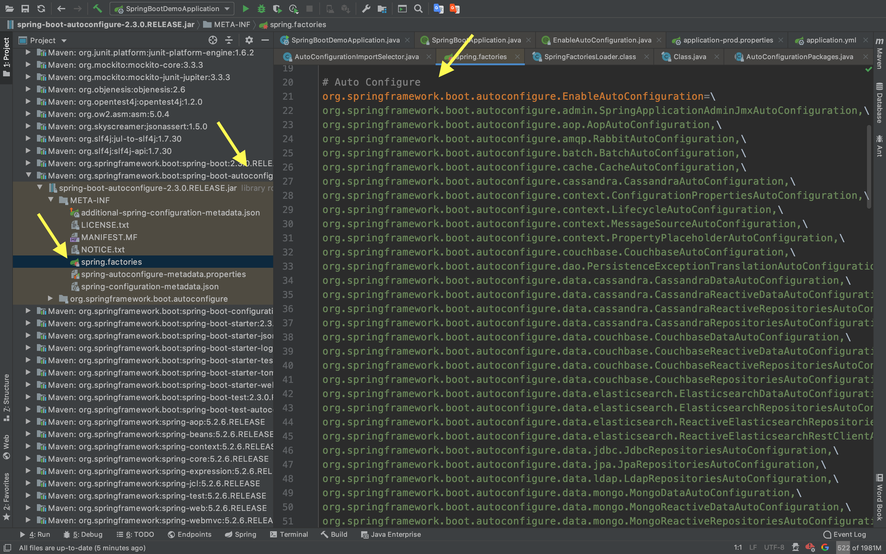
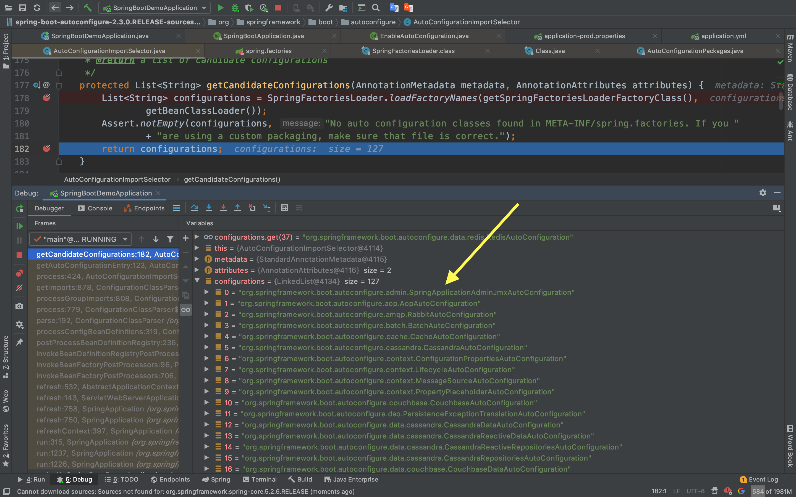
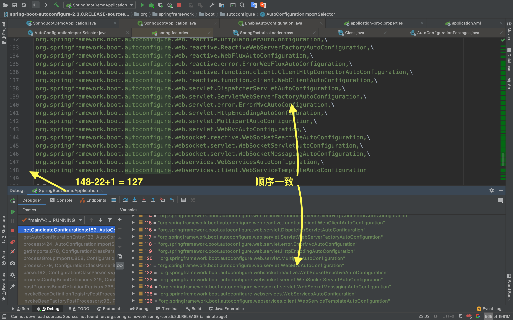
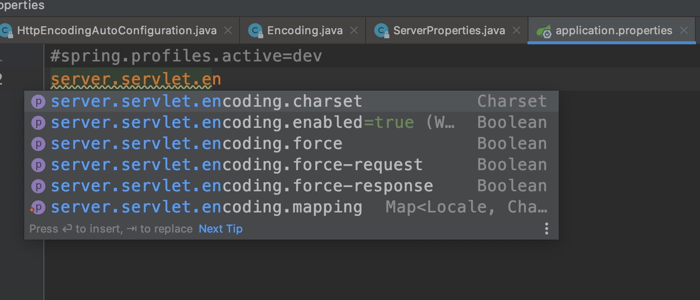

# 【02】SpringBoot自动配置

# 一、配置文件与相关注解

## 1. 配置文件

SpringBoot使用一个全局的配置文件，且名字是固定的：

- application.properties
- application.yml

配置文件的作用：修改Springboot自动配置的默认值；

除此之外，配置文件也可以描述类以及他的值：

### (1) @ConfigurationProperties获取值

比如我要声明一个Person类，可以通过读取yml配置文件中的配置，将所配置的值注入到声明的类中，以下展示一下过程：

```java
@Component // 2. 告诉Spring容器，我这里需要作为一个组件装载进容器中
@ConfigurationProperties(prefix = "person") 
// 1. 告诉这个类可以通过读取配置文件的方式获得属性，读取配置文件中的person
public class Person {
    private String name;
    private String id;
    // 要有getter、setter，否则之后的单元测试输出的是null
```

然后在yml配置文件中手动配置好：

```yaml
person:
  name: 张三
  id: 11
```

在单元测试的代码中测试：

```java
@SpringBootTest
class SpringBootDemoApplicationTests {
	@Autowired // 注入配置中的属性
	Person person;
	@Test
	void contextLoads() {
		System.out.println(person);
	}
}
// 得到：
// Person{name='张三', id='11'} 成功！
```

除了读取yml配置之外，application.properties也可以通过另一种注解来读取；

### (2) @Value 获取值

```txt
person.name=Alice
person.id=10
```

首先在application.properties中添加我们想要增加的属性值，其中的值都可以通过`@Value`依赖注入到想要的类中，比如以下面结合了此方法与上一种方法的Controller为例

```java
@RestController
// 这是ResponseBody和Controller的组合注解，
// 使用这个就可以不用在sayHello那里再加ResponseBody了
public class HelloController {

    @Value("${person.name}")
    private String name;

    private final Person person;
  
    // 注意：如果想要读取另一个配置文件，
    // 使其输出张三，就要在yml以及相应Controller注解上制定另一个配置文件中的person，
    // 比如这里我改成了person2，使其输出张三而不是person的Alice
    public HelloController(Person person) {
        this.person = person;
    }

    @RequestMapping("hello")
    public String sayHello() {
        return "Hello " + name + "; Hi " + person.getName();
      	// Hello Alice; Hi 张三
    }
}
```

## 2. 自定义配置文件

```java
@PropertySource(value = {"classpath:person.properties"})
public class Person {
  ...
```

在JavaBean之前加上该`@PropertySource`注解，就可以指定某个配置文件中的配置作为注入的值。

除此之外，可以在主入口类的上面使用`@ImportResource(value = {"classpath:xxx.properties"})`，向Spring容器加载相关组件。


SpringBoot推荐给容器中添加组件的方式：使用全注解的方式。

使用`@Bean`给容器中添加组件：当我们需要给应用增加一个Service时，需要声明好一个config作为配置

```java
/**
 * @Configuration: 指明当前类是个配置类。也就是代替Spring之前的xml配置
 */
@Configuration
public class HelloConfig {

    // 将方法的返回值添加到容器中
    @Bean // 就是类似Spring用xml标签<bean></bean>的形式添加组件
    public HelloService helloService02() {
        System.out.println("DONE");
        return new HelloService();
    }
}

```

以上这个方法，就相当于是在xml文件中，将一个HelloService以helloService02的id返回了。可以在下面的测试中看到：

```java
@SpringBootTest
class HelloServiceTest {
    @Autowired
    ApplicationContext ioc;
    @Test
    void testHelloService() {
        boolean hasService = ioc.containsBean("helloService02");
        // 注意containsBean名字是要和创建配置bean的方法名一致
        System.out.println(hasService);
        // true， 如果字符串里的和Config的方法名不一致，就是false了
    }

}
```


## 3. 配置文件占位符

并且，在properties文件中，还可以使用一些方法：比如随机数`${random.value}`、等等方法。并且还可以引用之前的变量。

## 4. 多Profile文件


在主配置文件编写时，文件名可以是`application-{XXX}.properties/yml`。

比如生产环境下命名为`application-prod.properties/yml`，开发环境是`application-dev.properties/yml`。

再根据需求激活不同的环境配置。

**(1) properties**

不过默认还是会使用`application.properties`的，所以需要在这个里面指定好需要激活的配置文件：

`spring.profiles.active=dev`

**(2) yml**

yml可以使用其特性：文档块进行区分不同的配置，而不再需要新建多个文件。

```yaml
server:
  port: 8080
spring:
  profiles:
    active: dev
---
server:
  port: 8081
spring:
  profiles: dev
---
server:
  port: 8082
spring:
  profiles: prod
```

**(3) 命令行**

以IDEA下开发为例，就是在Run/Debug Configuration下的Program arguments添加如下参数（较新的版本会是Override Parameter）

`--spring.profiles.active=dev`

除了上面开发环境下的配置之外，在部署时，我们会通过java -jar 命令来运行打包好的SpringBoot应用，这时候就可以在后面跟上上面的参数，让应用部署时启用需要的配置。

# 二、自动配置原理

自动配置流程【以SpringBoot 2.3.0 源码为例】：

在入口处我们都知道有个@SpringBootApplication注解，而其中有两个重要的注解

- @SpringBootConfiguration
- @EnableAutoConfiguration

## 1. 自动配置的源头：@EnableAutoConfiguration 

### （1）源码

1. SpringBoot启动的时候，加载了主配置类，开启了自动配置功能`@EnableAutoConfiguration`
2. `@EnableAutoConfiguration`的作用（可以参考第一章的源码浅析）：
   - 利用`AutoConfigurationImportSelector`这个selector给容器中导入一些组件。
   - 组件是通过`AutoConfigurationImportSelector#selectImports`这个方法获取候选的配置。
     - 该方法中的`getAutoConfigurationEntry`会获取到`List<String> configurations`，这就是我们想要的候选配置（比如AopAutoConfiguration、RedisAutoConfiguration百来个自动配置类）
     - 那么他是怎么得到的呢？`SpringFactoriesLoader.loadFactoryNames`
       通过这个方法扫描所有jar包类路径下 `META-INF/spring.factories`
       - 可以看图
         
         
         
     - 其作用:
       把扫描到的这些文件的内容包装成一个properties对象。
     - 从properties中获取到`EnableAutoConfiguration.class`这个类中对应的值，然后把他们放到容器中。
       （也就是上图中那127个自动配置类的上级，而他会打包到org.springframework.boot.autoconfigure.@EnableAutoConfiguration这个@SpringBootApplication下面的这个注解中）


### （2）小结：

在类路径下 META-INFO/spring.factories里面配置的所有`EnableAutoConfiguration`值加入到容器中：（注释一：指向的就是这个注解@EnableAutoConfiguration）

```
# 路径在：XXX/repository/org/springframework/boot/spring-boot-autoconfigure/2.3.0.RELEASE/spring-boot-autoconfigure-2.3.0.RELEASE.jar!/META-INF/spring.factories
# Auto Configure
org.springframework.boot.autoconfigure.EnableAutoConfiguration=\  注释一：EnableAutoConfiguration
org.springframework.boot.autoconfigure.admin.SpringApplicationAdminJmxAutoConfiguration,\
org.springframework.boot.autoconfigure.aop.AopAutoConfiguration,\
org.springframework.boot.autoconfigure.amqp.RabbitAutoConfiguration,\
org.springframework.boot.autoconfigure.batch.BatchAutoConfiguration,\
........
```

每个这样的xxxAutoConfiguration类都是容器中的一个组件，都加入到容器中，用他们来做自动配置。


## 2. 什么是自动配置

我们以一个自动配置类为例，在META-INF/spring.factories中找到`HttpEncodingAutoConfiguration`，用这个来解释什么是自动配置。

一进来就能看到很多注解，他们都干什么的？

### （1）入口注解

#### i. 源码

```java
@Configuration(proxyBeanMethods = false)  
// 表示这是一个配置类，和以前的xml形式的配置文件一样，也可以给容器添加组件
@EnableConfigurationProperties(ServerProperties.class) 
// 顾名思义，启用ConfigurationProperties，启用后面跟着的那个类：ServerProperties
@ConditionalOnWebApplication(type = ConditionalOnWebApplication.Type.SERVLET)
// 根据不同的条件，如果满足指定条件，配置类就会生效
@ConditionalOnClass(CharacterEncodingFilter.class)
// CharacterEncodingFilter是MVC中解决乱码的过滤器
@ConditionalOnProperty(prefix = "server.servlet.encoding", value = "enabled", matchIfMissing = true)
// 判断配置文件中是否存在某个配置，也就是server.servlet.encoding，返回true false，后面的missing表示即使没有，也会返回true生效
public class HttpEncodingAutoConfiguration {
```

1. @Configuration(proxyBeanMethods = false)  ：表示这是一个配置类，和以前的xml形式的配置文件一样，也可以给容器添加组件

2. @EnableConfigurationProperties(ServerProperties.class) ：顾名思义，启用ConfigurationProperties，启用后面跟着的那个类：ServerProperties。而这个类也不复杂：

   ```java
   @ConfigurationProperties(prefix = "server", ignoreUnknownFields = true)
   public class ServerProperties {
   ```

   上面@ConfigurationProperties，我们已经在一.1.(1)中已经知道了，是用配置文件中指定带有相应前缀的值和bean的属性进行绑定。将配置文件对应的值与ServerProperties绑定起来。

3. @ConditionalOnWebApplication：Spring底层的注解，根据不同的条件，如果满足指定条件，配置类就会生效。比如判断当前应用是不是web应用，如果是，当前配置就生效

4. @ConditionalOnClass(CharacterEncodingFilter.class)： CharacterEncodingFilter是MVC中解决乱码的过滤器

5. @ConditionalOnProperty(prefix = "server.servlet.encoding", value = "enabled", matchIfMissing = true)： 判断配置文件中是否存在某个配置，也就是server.servlet.encoding，返回true false，后面的missing表示即使没有，也会返回true生效


#### ii. 小结

以上注解，是根据当前不同的条件判断，决定这个自动配置类是否生效。

如果上面都生效了，那就进入到这个自动配置类里面了：

### （2）配置生效

#### i. 源码

```Java
@Bean 
// 给容器中添加一个组件，在这里也就是添加返回的组件：CharacterEncodingFilter。
@ConditionalOnMissingBean
public CharacterEncodingFilter characterEncodingFilter() {
   CharacterEncodingFilter filter = new OrderedCharacterEncodingFilter();
   filter.setEncoding(this.properties.getCharset().name());
   filter.setForceRequestEncoding(this.properties.shouldForce(Encoding.Type.REQUEST));
   filter.setForceResponseEncoding(this.properties.shouldForce(Encoding.Type.RESPONSE));
   return filter;
}
```


@Bean  给容器中添加一个组件，在这里也就是添加返回的组件：CharacterEncodingFilter。而通过代码

```java
filter.setEncoding(this.properties.getCharset().name());
...
```

可以发现，这个组件中的值需要从properties中获取。

```java
private final Encoding properties;

public HttpEncodingAutoConfiguration(ServerProperties properties) {
   this.properties = properties.getServlet().getEncoding(); // 来自于ServerProperties
}
```

而这个properties的来源，其实就是ServerProperties

```java
@ConfigurationProperties(prefix = "server", ignoreUnknownFields = true)
public class ServerProperties {
```

上上面这个唯一的有参构造器，和上面这个配置文件结合，与@EnableConfigurationProperties(ServerProperties.class) 这个注解联动，将ServerProperties.class加入到Spring ioc容器中。

所以我们就可以在properties中，依次对我们想要设置的配置bean设值，自动配置类就可以通过上文的代码和注解，读取到我们的配置，然后生成相应的bean注册到ioc容器中由spring框架或业务方使用。




所以我们在propertis这个文件中所能够配置的，都是相应的properties提供的`private final Encoding properties;`。我们在application.properties这个文本文件中，`ctrl+左键`也是可以锁定到相应的类中，这也侧面表明了两者的联系。

#### ii. 小结

一旦这个自动配置类生效，这个配置类就会给容器中中添加组件`@Bean`，这些组件的属性是从相应的Properties类`上文案例中的Encoding`中获取的，而这些类的属性又和配置文件`application.properties`中的自定义值绑定。
